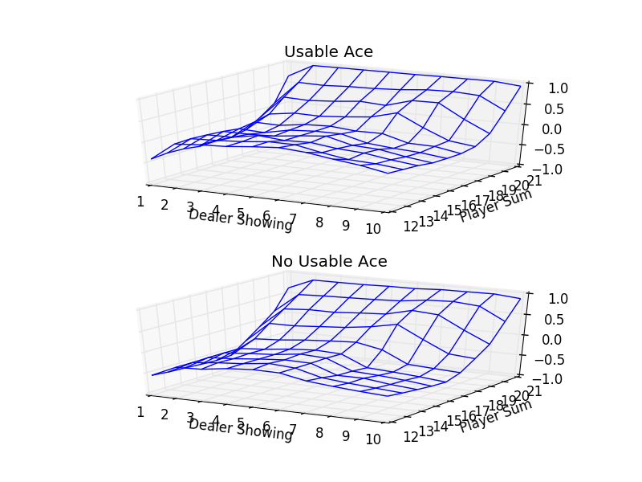

# reinforcement_learning
Playing around with Reinforcement Learning, running simulations.

Based on "Reinforcement Learning - An Introduction" by Sutton and Brato.

Currently has a Monte Carlo black jack simulation, and an N Bandits simulation using different Agent algorithms.

# Setup
```bash
conda env create
source activate reinf
```

# Monte Carlo Blackjack Learner
Uses e-greedy methods to find an optimal action value function and policy.

## Running
```bash
python src/monte_carlo_blackjack.py
```

## Output


# N-Bandits with various learning agents
Simulate the static n-bandits problem with e-greedy, e-greedy softmax, pursuit, and reinforcement comparison agents.

## Running
```bash
python src/runner.py simulations/<your_simulation>.yml
```

## Configuration
All settings are in the settings/*.yml files, and should be self-evident
