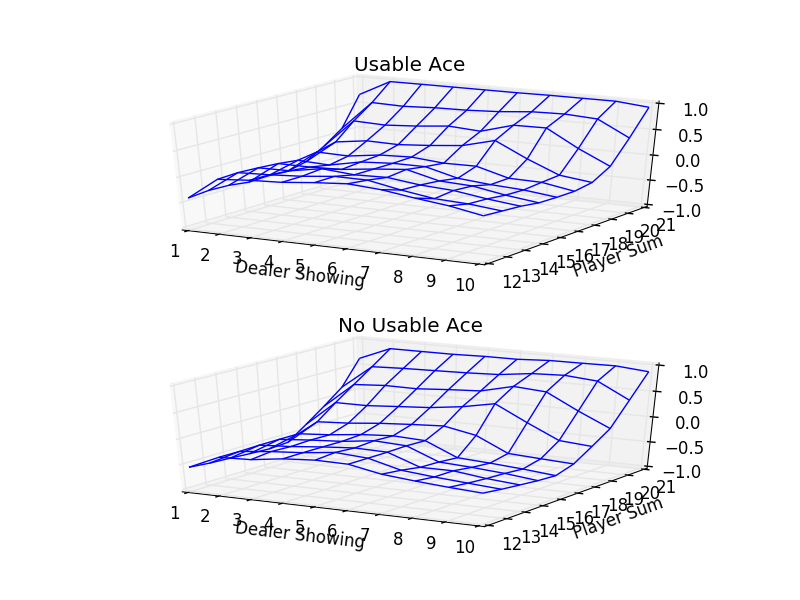
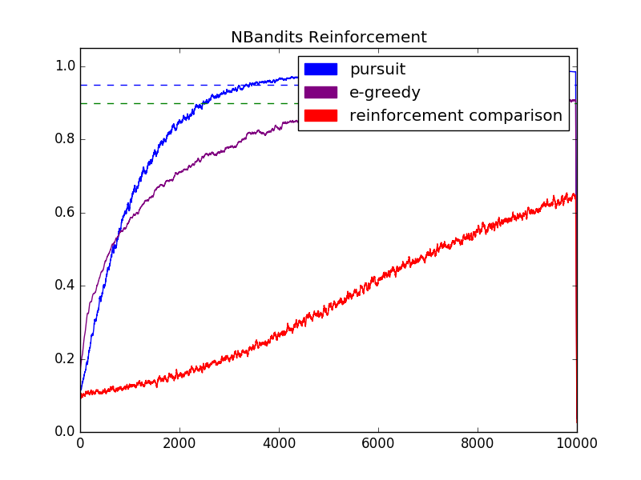

# Reinforcement Learning Experiments
This repo is just me playing around with reinforcement learning, running simulations. Most are based on "Reinforcement Learning - An Introduction" by Sutton and Barto.

It currently has a Monte Carlo black jack simulation from chapter 5, and an N Bandits simulation using different agent algorithms from chapter 2.

To set up the environment, run:
```bash
conda env create
source activate reinf
```

# Tetris - Deep Reinforcement Learning
Use a deep reinforcement learning algorithm to learn a tetris playing agent.

Takes advantage of a Kears/Theano/Cuda stack to learn a neural net Q-function.

(In Progress)

```bash
python src/tetris/simulation.py
```

# Monte Carlo Blackjack (Chapter 5)
Uses e-greedy methods to find an optimal action value function and policy.

```bash
python src/monte_carlo_blackjack.py
```

The following was an attempt to recreate fig 5.5 in Sutton and Barto, using a Monte Carlo, "on-policy", e-greedy model. There seem to be a few minor differences I haven't worked out yet.



# N-Bandits (Chapter 2)
Simulate the static n-bandits problem with e-greedy, e-greedy softmax, pursuit, and reinforcement comparison agents. All settings are in the settings/*.yml files, and should be self-evident

```bash
python src/runner.py simulations/<your_simulation>.yml
```

